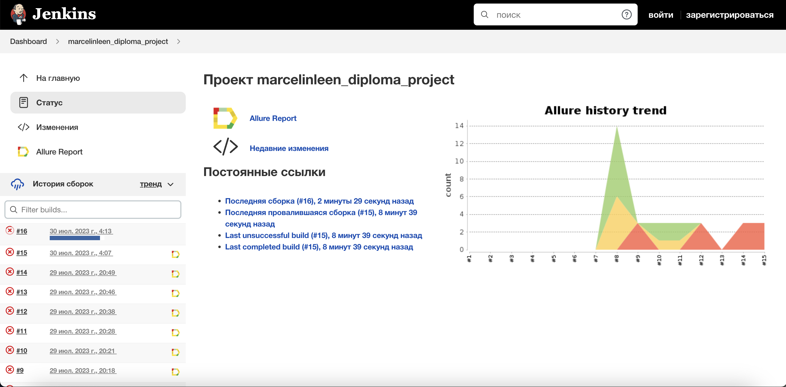

# QA Guru: Дипломный проект
Реализация набора автотестов (UI, Mobile, API) для сервиса <code>Last.FM</code>

# Инструменты и технологии, используемые в проекте
<p align="center">
<a href="https://www.python.org/"></a>
<a href="https://www.selenium.dev/"></a>
<a href="https://docs.pytest.org/en/"></a>
<a href="https://www.jetbrains.com/ru-ru/pycharm/"></a>
<a href="https://docs.pydantic.dev/latest/"></a>
<a href="https://pypi.org/project/python-dotenv/"></a>
<a href="https://www.jenkins.io/"></a>
<a href="https://python-poetry.org/"></a>
<a href="https://www.last.fm/api"></a>
</p>

Весь проект выполнен на языке <code>Python</code>, а также дополнительно:
 - для UI-тестов применялись: <code>Selene</code>
 - для API-тестов применялись: <code>Requests</code>, <code>JSONSchema</code>
 - для мобильных тестов на Android: <code>Appium</code>

Запуск тестов и формирование отчетов о запусках формируется с помощью:
 - <code>Jenkins</code>
 - <code>Selenoid</code>
 - <code>Browserstack</code>

# Покрытый функционал

## UI-тесты

 - авторизация пользователя;
 - поиск исполнителя, альбома и трека;
 - подписка на другого юзера (добавление в друзья);
 - отписка от другого другого юзера (удаление из друзей);
 - выход из учетной записи

## API-тесты
 - авторизация пользователя;
 - поиск исполнителя, альбома и трека (успешный и неуспешный);
 - добавить трек в **Понравившиеся**;
 - получить список треков из **Понравившихся**

## Мобильные тесты
 - авторизация пользователя;
 - получение истории чартов юзера за определенный период (30 дней);
 - выход из учетной записи

# <a href='https://jenkins.autotests.cloud/job/marcelinleen_diploma_project/'>Jenkins job</a>
</a>

## Удаленный запуск
Удаленный запуск происходит по команде:
```
python -m venv .venv
source .venv/bin/activate
pip install poetry
poetry install --no-root
pytest tests
```

# Локальный запуск
Для локального запуска необходимо произвести команду:
```
pytest tests
```
При этом мобильные тесты могут быть запущены как в <code>BrowserStack</code>, так и локально. Для этого необходимо при запуске указать команду:
```
pytest --env=local tests/mobile/
```
Пример такого параметризованного запуска можно увидеть на <a href="https://www.loom.com/share/a35e74b30d6a4edf976cac0692f16e62?sid=eb825c54-55ef-4223-8cda-25e3dbe1f011">видео</a>.
По умолчанию запуск тестов происходит на <code>BrowserStack</code>.