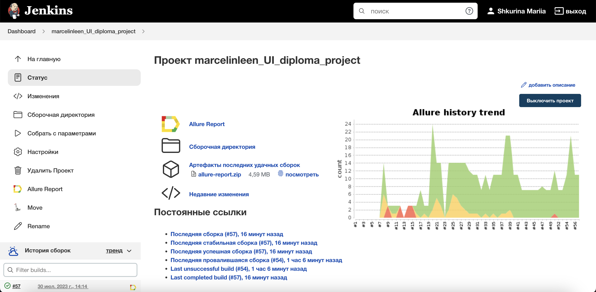
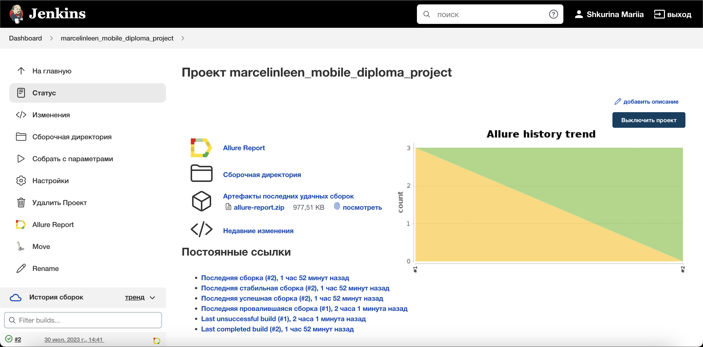
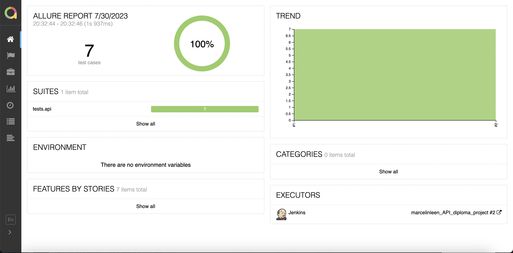

# QA Guru: Дипломный проект
Реализация набора автотестов (UI, Mobile, API) для сервиса <code>Last.FM</code>

# Инструменты и технологии, используемые в проекте
<p align="center">
<a href="https://www.python.org/"></a>
<a href="https://www.selenium.dev/"></a>
<a href="https://docs.pytest.org/en/"></a>
<a href="https://www.jetbrains.com/ru-ru/pycharm/"></a>
<a href="https://docs.pydantic.dev/latest/"></a>
<a href="https://pypi.org/project/python-dotenv/"></a>
<a href="https://www.jenkins.io/"></a>
<a href="https://python-poetry.org/"></a>
<a href="https://www.last.fm/api"></a>
</p>

Весь проект выполнен на языке <code>Python</code>, а также дополнительно:
 - для UI-тестов применялись: <code>Selene</code>
 - для API-тестов применялись: <code>Requests</code>, <code>JSONSchema</code>
 - для мобильных тестов на Android: <code>Appium</code>

Запуск тестов и формирование отчетов о запусках формируется с помощью:
 - <code>Jenkins</code>
 - <code>Selenoid</code>
 - <code>Browserstack</code>

# Покрытый функционал

## <a href='https://github.com/marcelinleen/qa_guru_diploma/tree/main/tests/web'>UI-тесты</a>
 - авторизация пользователя;
 - поиск исполнителя, альбома и трека;
 - подписка на другого юзера (добавление в друзья);
 - просмотр понравившихся треков;
 - выход из учетной записи

## <a href='https://github.com/marcelinleen/qa_guru_diploma/tree/main/tests/api'>API-тесты</a>
 - авторизация пользователя;
 - поиск исполнителя, альбома и трека (успешный и неуспешный);
 - добавить трек в **Понравившиеся**;
 - получить список треков из **Понравившихся**

## <a href='https://github.com/marcelinleen/qa_guru_diploma/tree/main/tests/mobile'>Мобильные тесты</a>
 - авторизация пользователя;
 - получение истории чартов юзера за определенный период (30 дней);
 - выход из учетной записи

## <a href='https://jenkins.autotests.cloud/job/marcelinleen_UI_diploma_project/'>Jenkins job для UI-тестов</a>
</a>

## <a href='https://jenkins.autotests.cloud/job/marcelinleen_API_diploma_project/'>Jenkins job для API-тестов</a>
</a>

## <a href='https://jenkins.autotests.cloud/job/marcelinleen_mobile_diploma_project/'>Jenkins job для мобильных тестов</a>
</a>

## Удаленный запуск
Удаленный запуск происходит по команде:

### UI-тесты:
```
python -m venv .venv
source .venv/bin/activate
pip install poetry
poetry install --no-root
pytest --browser=${BROWSER} --browser_version=${BROWSER_VERSION} tests/web
```

### API-тесты:
```
python -m venv .venv
source .venv/bin/activate
pip install poetry
poetry install --no-root
pytest tests/api
```

### Мобильные тесты:
```
python -m venv .venv
source .venv/bin/activate
pip install poetry
poetry install --no-root
pytest --env=${ENV} tests/mobile
```

# Локальный запуск
Для локального запуска с значениями по умолчанию необходимо произвести команду:
```
pytest tests
```

## Локальный запуск мобильных тестов

Мобильные тесты могут быть запущены как в <code>BrowserStack</code>, так и локально. 
Для запуска в BrowserStack необходимо указать команду:
```
pytest --env=browserstack tests/mobile/
```

Тогда как для локального запуска:
```
pytest --env=local tests/mobile/
```

При этом, для запуска мобильных тестов локально, необходимо убедиться, что:
 - <code>Appium Server</code> запущен;
 - эмулятор и/или реальный девайс подключен;
 - созданы настройки для запуска в _.env-файл_, расположенные в директории <code>tests/mobile</code>. Пример настроек можно найти в файле <a href='https://github.com/marcelinleen/qa_guru_diploma/blob/main/tests/mobile/.env.mobile.local.example'>.env.mobile.local.example</a>

Пример такого параметризованного запуска можно увидеть на <a href="https://www.loom.com/share/a35e74b30d6a4edf976cac0692f16e62?sid=eb825c54-55ef-4223-8cda-25e3dbe1f011">видео</a>.
По умолчанию запуск тестов происходит на <code>BrowserStack</code>.

# Подготовка к удаленному запуску
### Удаленный запуск UI-тестов
Для запуска UI-тестов, в разделе **Сборка**, необходимо добавить шаг по созданию/изменению .env-файл с данными тестовой учетной записи (**LOGIN**, **PASSWORD**), а также указать данные для авторизации на стороне Selenoid (**SELENOID_LOGIN**, **SELENOID_PASSWORD**).
В проекте все чувствительные данные хранятся в файле <code>.env.personal_data</code> - его пример можно найти в проекте в файле <a href='https://github.com/marcelinleen/qa_guru_diploma/blob/main/.env.personal_data.example'>.env.personal_data.example</a>

</a>

### Удаленный запуск API-тестов
Для запуска API-тестов, в тот же файл <code>.env.personal_data</code> необходимо добавить данные тестовые учетной записи (**LOGIN**, **PASSWORD**), а также API-данные учетной записи (**API_KEY**, **API_SECRET**) - пример таких данных также можно найти в файле <a href='https://github.com/marcelinleen/qa_guru_diploma/blob/main/.env.personal_data.example'>.env.personal_data.example</a>.

Актуальные для юзера данные можно найти на [странице API-подключений](https://www.last.fm/api/accounts) после авторизации на сервисе.
</a>

</a>

### Удаленный запуск мобильных тестов
Для запуска мобильных тестов, в разделе **Сборка**, необходимо добавить шаг по созданию/изменению .env-файл с данными тестовой учетной записи (**LOGIN**, **PASSWORD**).

</a>

Также необходимо добавить шаг по созданию/изменению .env-файл в директории <code>tests/mobile</code> с указанием следующих настроек, необходимых для подключению к **BrowserStack**:

</a>

Пример данного файла есть в проекте - <a href='https://github.com/marcelinleen/qa_guru_diploma/blob/main/tests/mobile/.env.mobile.browserstack.example'>.env.mobile.browserstack.example</a>.

# Отчеты о запусках

### Allure для UI-тестов

</a>

### Allure для API-тестов

</a>

### Allure для мобильных тестов

</a>